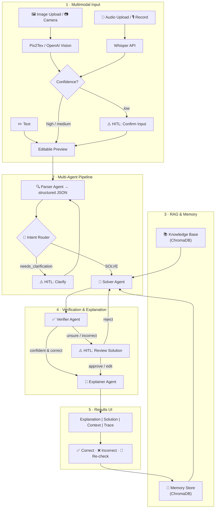

<div align="center">

# 🧮 Multimodal Math Mentor

**AI-powered math tutor for JEE-level competitive exams**

*RAG · Multi-Agent · Human-in-the-Loop · Memory · Multimodal Input*

[](https://www.python.org/)
[](https://streamlit.io/)
[](https://platform.openai.com/)
[](LICENSE)

</div>

---

## 📌 Table of Contents

- [Overview](#overview)
- [Features](#features)
- [Architecture](#architecture)
- [Project Structure](#project-structure)
- [Tech Stack](#tech-stack)
- [Getting Started](#getting-started)
- [Usage](#usage)
- [Deployment](#deployment)
- [Knowledge Base](#knowledge-base)
- [PDF Ingestion](#pdf-ingestion)
- [HITL Triggers](#hitl-triggers)
- [Memory](#memory)
- [Contributing](#contributing)
- [License](#license)

---

## Overview

**Multimodal Math Mentor** is a prototype AI tutoring system that accepts math problems as **text**, **images** (upload or camera), or **audio** (upload or live recording) and produces **step-by-step, student-friendly explanations**.

Under the hood it runs a **5-agent pipeline** orchestrated with:

| Technique | Purpose |
|-----------|---------|
| **RAG** (Retrieval-Augmented Generation) | Grounds answers in a curated JEE-level knowledge base + optional PDFs |
| **Multi-Agent Architecture** | Separates parsing, solving, verification, and explanation into specialised agents |
| **Human-in-the-Loop (HITL)** | Pauses the pipeline when confidence is low or the problem is ambiguous |
| **Memory** | Stores solved problems so future similar questions can reuse solution patterns |

---

## Features

- **Multimodal input** — text, image upload, camera capture, audio upload, live mic recording
- **Math-aware OCR** via [Pix2Tex](https://github.com/lukas-blecher/LaTeX-OCR) (1st) → OpenAI Vision (2nd) → EasyOCR (3rd) — see [why Pix2Tex](#-why-pix2tex-for-ocr)
- **Math-aware Speech-to-text** via OpenAI Whisper API + GPT post-processing
- **5 specialised agents** — Parser, Intent Router, Solver, Verifier, Explainer
- **RAG retrieval** from 95+ curated JEE formulas + auto-ingested PDFs with **context-aware chunking** — see [why context-aware chunking](#-why-context-aware-chunking)
- **Memory store** — previously solved Q&A pairs improve future answers
- **3 HITL checkpoints** — low-confidence input, ambiguous problem, uncertain verification
- **User feedback loop** — ✅ Correct / ❌ Incorrect + comment / 🔄 Re-check
- **Agent trace panel** — see exactly which agents ran, when, and why
- **Retrieved context panel** — inspect RAG and memory hits

---

## Architecture



### Agent Roles

| # | Agent | Responsibility |
|---|-------|----------------|
| 1 | **Parser Agent** | Cleans raw OCR/ASR text → structured JSON (`problem_text`, `topic`, `variables`, `constraints`, `needs_clarification`) |
| 2 | **Intent Router** | Deterministic routing — forwards to Solver or triggers HITL for clarification |
| 3 | **Solver Agent** | Queries RAG knowledge base + memory store, generates step-by-step solution with confidence label |
| 4 | **Verifier Agent** | Checks mathematical correctness, units/domain validity, and edge cases |
| 5 | **Explainer Agent** | Rewrites the verified solution as a student-friendly numbered explanation |

---

## Project Structure

```
AI_Planet_Assignment/
│
├── app.py                  # Streamlit entry point (thin orchestrator)
├── config.py               # Centralised paths, model name, env vars
├── llm.py                  # OpenAI Chat Completions wrapper (call_llm)
├── agents.py               # 5 agent definitions + trace logger
├── pipeline.py             # Sequential pipeline with HITL pause points
├── rag.py                  # RAG: ChromaDB collection from JSON + PDFs
├── memory.py               # Memory: solved Q&A vector store
├── input_handlers.py       # OCR (Pix2Tex → OpenAI Vision → EasyOCR) & ASR (Whisper API)
├── ui.py                   # Streamlit UI components (sidebar, HITL, results)
│
├── knowledge_base.json     # 95 curated JEE-level formulas & templates
├── docs/                   # Drop PDFs here for auto-ingestion into RAG
├── requirements.txt        # Python dependencies
├── .env.example            # Template for environment variables
├── README.md               # ← You are here
└── .chroma_data/           # ChromaDB persistence (auto-created at runtime)
```

### Module Dependency Graph

```
app.py
├── config.py
├── pipeline.py
│   ├── agents.py
│   │   ├── llm.py       ← config.py
│   │   ├── rag.py        ← config.py
│   │   └── memory.py     ← config.py
│   └── memory.py
└── ui.py
    ├── input_handlers.py
    ├── pipeline.py
    ├── agents.py
    └── memory.py
```

---

## Tech Stack

| Component | Library / Service |
|-----------|-------------------|
| **UI Framework** | [Streamlit](https://streamlit.io/) |
| **LLM** | [OpenAI GPT-4o-mini](https://platform.openai.com/) via `openai` |
| **Vector Store** | [ChromaDB](https://www.trychroma.com/) (in-process, cosine similarity) |
| **Embeddings** | ChromaDB default (`all-MiniLM-L6-v2`) |
| **OCR** | [Pix2Tex](https://github.com/lukas-blecher/LaTeX-OCR) (primary) · OpenAI Vision (fallback) · [EasyOCR](https://github.com/JaidedAI/EasyOCR) (final fallback) |
| **Speech-to-Text** | [OpenAI Whisper API](https://platform.openai.com/docs/guides/speech-to-text) + GPT post-processing |
| **Audio Recording** | [audio-recorder-streamlit](https://github.com/theevann/streamlit-audiorecorder) |
| **PDF Parsing** | [pdfplumber](https://github.com/jsvine/pdfplumber) |

---

## Getting Started

### Prerequisites

- Python 3.10+
- An [OpenAI API key](https://platform.openai.com/api-keys)

### 1. Clone the repository

```bash
git clone https://github.com/Hadar01/Multimodal-Math-Mentor.git
cd Multimodal-Math-Mentor
```

### 2. Create a virtual environment (recommended)

```bash
python -m venv .venv
# Windows
.venv\Scripts\activate
# macOS / Linux
source .venv/bin/activate
```

### 3. Install dependencies

```bash
pip install -r requirements.txt
```

### 4. Configure environment

```bash
cp .env.example .env
```

Open `.env` and paste your **OpenAI API Key**:

```
OPENAI_API_KEY=your-key-here
```

> You can also enter the key directly in the app sidebar at runtime.

### 5. Run the app

```bash
streamlit run app.py
```

The app opens at **http://localhost:8501**.

---

## Usage

1. **Choose input mode** — Text, Image (upload/camera), or Audio (upload/record)
2. **Review** the extracted text in the editable preview
3. Click **🚀 Solve**
4. If the pipeline pauses (HITL), review and confirm
5. Explore the **4 result tabs**: Explanation, Raw Solution, Retrieved Context, Agent Trace
6. Give **feedback** — ✅ Correct, ❌ Incorrect + comment, or 🔄 Re-check

---

## Deployment

### Option 1: Streamlit Community Cloud (fastest)

1. Push this project to GitHub.
2. Go to [share.streamlit.io](https://share.streamlit.io/) and click **New app**.
3. Select your repo, branch, and set main file path to `app.py`.
4. In **Advanced settings**, add this secret:

```toml
OPENAI_API_KEY="your-openai-api-key"
```

5. Click **Deploy**.

### Option 2: Render (good for continuous hosting)

1. Push the project to GitHub.
2. In Render, create a new **Web Service** from the repo.
3. Use these settings:

```text
Build Command: pip install -r requirements.txt
Start Command: streamlit run app.py --server.port $PORT --server.address 0.0.0.0
```

4. Add environment variable:

```text
OPENAI_API_KEY=your-openai-api-key
```

5. Deploy the service.

### Deployment notes

1. First build can be slow because `pix2tex` pulls ML dependencies.
2. If build resources are tight, make `pix2tex` optional and rely on OpenAI Vision fallback.
3. Persisted local data (`.chroma_data/`) is ephemeral on most free hosts; for production, use an external vector DB.

---

## Knowledge Base

The file `knowledge_base.json` contains **95 curated JEE-level entries** across:

| Category | Topics |
|----------|--------|
| **Algebra** (17) | Quadratics, AP/GP/HP, AM-GM, binomial theorem, complex numbers, De Moivre, logarithms, partial fractions, mathematical induction, sum of powers |
| **Calculus** (21) | Limits, continuity, all derivative rules, Rolle's & MVT, Taylor series, integration methods, definite integral properties, area between curves, differential equations |
| **Coord. Geometry** (9) | Distance/section formula, lines, circles, parabola, ellipse, hyperbola, tangent to conics |
| **Trigonometry** (8) | Identities, sum/difference/double/half angle, product-to-sum, inverse trig, general solutions |
| **Linear Algebra** (7) | 2×2 & 3×3 determinants, inverse, Cramer's rule, eigenvalues, Cayley-Hamilton |
| **Vectors & 3D** (6) | Dot/cross product, scalar triple product, line/plane equations, angles & distances |
| **Probability** (6) | Permutations, combinations, Bayes, binomial distribution, mean/variance |
| **Templates** (6) | Step-by-step approaches for optimization, linear systems, conics, DEs, vectors |
| **Common Mistakes** (9) | √(a²+b²)≠a+b, (a+b)²≠a²+b², inequality flip, product rule, log rules, +C, P vs C, inverse trig, det(kA) |

> **To add entries:** append `{"topic": "...", "formula": "...", "example": "..."}` to `knowledge_base.json` and delete `.chroma_data/`.

---

## PDF Ingestion

Drop any `.pdf` files into the `docs/` folder.  On next startup, the app will:

1. Extract text via **pdfplumber**
2. Detect section-like boundaries (headings / paragraph breaks)
3. Split into **sentence-aware chunks** (about 700 chars) with ~120-char overlap
4. Load into ChromaDB alongside the JSON knowledge base

No code changes needed — just restart the app after adding PDFs.

> See [Why context-aware chunking?](#-why-context-aware-chunking) for the design rationale.

---

## 🔬 Design Decisions

### 📐 Why Pix2Tex for OCR?

Most general-purpose OCR engines (Tesseract, EasyOCR) treat a math expression like
`∫₀^π sin(x)dx` as arbitrary characters and return garbled text — losing superscripts,
fractions, Greek letters, and integral bounds completely.

**[Pix2Tex (LaTeX-OCR)](https://github.com/lukas-blecher/LaTeX-OCR)** is a deep-learning model
trained *specifically* on mathematical notation. It outputs **valid LaTeX** directly (e.g.
`\int_{0}^{\pi} \sin(x)\,dx`), which means:

| Benefit | Detail |
|---------|--------|
| **Structural accuracy** | Fractions, limits, summations, matrices rendered correctly — not just the individual symbols |
| **LaTeX output** | Downstream agents and the UI receive parseable LaTeX, enabling faithful math rendering with MathJax / KaTeX |
| **JEE-domain fit** | Trained on academic math papers and textbooks — exactly the content style of JEE problems |
| **Fallback safety** | If Pix2Tex confidence is low, the pipeline automatically falls back to OpenAI Vision (cloud) then EasyOCR — so general text on diagrams is still captured |

### 📄 Why Context-Aware Chunking?

Naïve chunking (splitting a document every N characters) breaks mathematical text at the
worst possible points — e.g. splitting a formula across two chunks, or separating a theorem
statement from its proof.

**Context-aware chunking** in this project works as follows:

1. **Section boundary detection** — the PDF text is scanned for heading-like lines
   (short lines, numbered sections, ALL-CAPS titles). Each detected heading starts a new chunk boundary.
2. **Sentence-aligned splitting** — within a section, text is split at sentence boundaries
   (`. `, `? `, `! `) rather than mid-sentence, keeping mathematical reasoning intact.
3. **Overlap window** — consecutive chunks share ~120 characters of overlap so that a
   formula referenced at the end of one chunk is still present at the start of the next,
   preventing retrieval gaps.

| Naive Chunking | Context-Aware Chunking |
|----------------|------------------------|
| Splits mid-formula | Respects sentence and heading boundaries |
| Retrieved chunk may lack context | Overlap window preserves surrounding context |
| Same chunk size regardless of structure | Chunk boundaries follow document structure |
| Poor recall for multi-step proofs | Keeps theorem + proof together in one chunk |

---

## HITL Triggers

The pipeline pauses and asks for human input when:

| Trigger | Condition | Action |
|---------|-----------|--------|
| **Low-confidence input** | OCR/ASR avg confidence < 0.5 | User corrects extracted text |
| **Ambiguous problem** | Parser sets `needs_clarification = true` | User clarifies or edits |
| **Uncertain verification** | Verifier confidence = low OR `is_correct = false` | User approves / edits / rejects |
| **Explicit re-check** | User clicks 🔄 Re-check | Pipeline re-runs Solver → Verifier → Explainer |

---

## Memory

Each solved problem stores a rich record in a **ChromaDB collection**:

```json
{
  "original_input": "...",
  "input_mode": "text | image | audio",
  "parsed_question": "...",
  "retrieved_context": "...",
  "final_answer": "...",
  "verifier_outcome": { "is_correct": true, "confidence": "high", "feedback": "..." },
  "user_feedback": { "label": "correct", "comment": "" }
}
```

Before solving a new problem, the **Solver Agent** searches memory for similar past solutions to reuse patterns.

---

## Contributing

1. Fork the repository
2. Create a feature branch (`git checkout -b feature/your-feature`)
3. Commit your changes (`git commit -m "Add your feature"`)
4. Push to the branch (`git push origin feature/your-feature`)
5. Open a Pull Request

---

## License

This project is licensed under the **MIT License** — see the [LICENSE](LICENSE) file for details.

---

<div align="center">

Built with ❤️ for the **AI Planet** assignment

</div>
